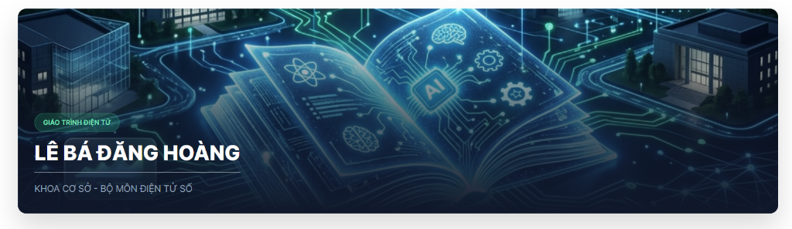

<p align="center">
  
</p>

<h1 align="center">📘 Nền Tảng E-Learning: Xây Dựng Ứng Dụng AI</h1>

<p align="center">
  <em>Hệ thống giáo trình điện tử tương tác — Hướng dẫn xây dựng ứng dụng AI trong môi trường Hành chính – Sư phạm</em>
</p>

<p align="center">
  
  
  
  
  
</p>

---

## 📋 Tổng Quan

Đây là nền tảng E-Learning tương tác được thiết kế dành cho **giảng viên, chuyên viên quản lý giáo dục** — những người không cần nền tảng lập trình — có thể tự xây dựng ứng dụng AI phục vụ công tác giảng dạy và hành chính.

Giáo trình được xây dựng dưới dạng **ứng dụng web đơn trang (SPA)** với khả năng đóng gói thành phần mềm desktop (Electron), bao gồm:

- 📖 Nội dung giáo trình Markdown tương tác
- 🧩 Sơ đồ flowchart và biểu đồ so sánh động (Mermaid + React)
- 🎯 Hệ thống kiểm tra trắc nghiệm 10 câu với chấm điểm tự động
- 🎬 Video hướng dẫn thực hành quy trình 5 bước
- ✏️ Trình soạn thảo nội dung trực tiếp dành cho quản trị viên

---

## 🌐 Truy Cập Trực Tuyến (Trải Nghiệm Web App Tức Thì)

Tài liệu giáo trình đã được biên dịch và đưa lên mạng thành một Website độc lập, tương thích tuyệt đối với cả **Máy tính và Điện thoại di động**. Bạn không cần tải hay cài đặt bất cứ thứ gì!

<p align="center">
  <a href="https://danghoangsqtt-sys.github.io/ai-maker-doc/" target="_blank">
    
  </a>
</p>
<p align="center"><em>*Quét mã QR trong slide thuyết trình hoặc click thẳng vào link trên để xem bài giảng điện tử.</em></p>

---

## 🏗️ Cấu Trúc Giáo Trình

Nội dung được chia thành **4 chương chính**, xoay quanh **Quy trình 5 Bước** xây dựng ứng dụng AI:

```
┌─────────────────────────────────────────────────────────┐
│  CHƯƠNG I:  Nắm Vững Tư Duy Cốt Lõi                   │
│  ► AI là gì? Prompt Engineering, System Prompt          │
├─────────────────────────────────────────────────────────┤
│  CHƯƠNG II: Quy Trình 5 Bước Phát Triển Ứng Dụng AI   │
│  ► Xác Định → Thiết Kế → Tích Hợp → Kiểm Thử → Triển │
│    Khai (kèm flowchart tương tác & bảng so sánh)       │
├─────────────────────────────────────────────────────────┤
│  CHƯƠNG III: Ví Dụ Thực Chiến                          │
│  ► Ví dụ 1: Chatbot EduBot (Phần mềm, Gemini Canvas)  │
│  ► Ví dụ 2: Đèn Học Thông Minh (Phần cứng, RPi Pico)  │
│  ► Mỗi ví dụ kèm video hướng dẫn quy trình 5 bước    │
├─────────────────────────────────────────────────────────┤
│  CHƯƠNG IV: Kiểm Tra & Đánh Giá                        │
│  ► Bài kiểm tra trắc nghiệm 10 câu tương tác          │
└─────────────────────────────────────────────────────────┘
```

### Quy Trình 5 Bước

| Bước | Tên | Mô tả |
|------|-----|-------|
| 1 | **Xác Định & Phân Rã** | Làm rõ bài toán, xác định Input/Output |
| 2 | **Thiết Kế & Lập Trình** | Craft prompt và sử dụng Gemini Canvas |
| 3 | **Tích Hợp Lõi AI** | Gắn API, thiết lập System Prompt |
| 4 | **Kiểm Thử Kép** | QA chức năng + QA hành vi AI |
| 5 | **Triển Khai & Đóng Gói** | Deploy sản phẩm hoàn chỉnh |

---

## 🚀 Cài Đặt & Chạy

### Yêu cầu hệ thống

- [Node.js](https://nodejs.org/) >= 18.x
- npm >= 9.x

### Khởi chạy Web (Development)

```bash
# Clone dự án
git clone https://github.com/<your-username>/ai-elearning-platform.git
cd ai-elearning-platform

# Cài đặt dependencies
npm install

# Khởi chạy dev server
npm run dev
```

Truy cập tại: **http://localhost:5173**

### Khởi chạy Desktop (Electron)

```bash
# Chạy đồng thời Vite + Electron
npm run dev:electron
```

### Build sản phẩm

```bash
# Build web production
npm run build

# Build ứng dụng desktop (.exe)
npm run build:electron
```

---

## 📂 Cấu Trúc Thư Mục

```
ai_quan_su_elearning/
├── public/
│   ├── cover.png                  # Ảnh bìa giáo trình
│   ├── favicon.svg                # Icon ứng dụng
│   └── videos/
│       ├── tutorial_1_v4.mp4      # Video quy trình EduBot (Gemini Canvas)
│       └── tutorial_2_v4.mp4      # Video quy trình Smart Lamp (RPi Pico + Wokwi)
├── src/
│   ├── App.jsx                    # Component gốc, routing & layout
│   ├── App.css                    # Stylesheet chính
│   ├── index.css                  # Design system & CSS tokens
│   ├── main.jsx                   # Entry point React
│   ├── components/
│   │   ├── diagrams/
│   │   │   ├── AIFlowchart.jsx          # Flowchart tương tác quy trình 5 bước
│   │   │   ├── AIFlowchart_5_Steps.jsx  # Phiên bản flowchart chi tiết
│   │   │   └── QACycleFlow.jsx          # Sơ đồ vòng lặp Kiểm thử Kép
│   │   ├── quiz/
│   │   │   └── InteractiveQuiz.jsx      # Hệ thống trắc nghiệm 10 câu
│   │   └── ui/                          # UI components dùng chung
│   ├── content/
│   │   ├── raw_data.md            # Toàn bộ nội dung giáo trình (Markdown)
│   │   └── dataUtils.js           # Xử lý parse & render Markdown
│   └── features/
│       └── editor/
│           └── AdminEditor.jsx    # Trình soạn thảo nội dung cho quản trị viên
├── electron/
│   ├── main.cjs                   # Electron main process
│   └── preload.cjs                # Electron preload script (IPC bridge)
├── package.json
├── vite.config.js
└── tailwind.config.js
```

---

## ✨ Tính Năng Nổi Bật

### 🎯 Giáo Trình Tương Tác
- Nội dung Markdown được render real-time với `react-markdown` + `rehype-raw`
- Hỗ trợ bảng, code block, blockquote, HTML inline
- Điều hướng giữa các chương bằng thanh sidebar

### 📊 Sơ Đồ & Biểu Đồ Động
- **Flowchart 5 Bước**: Animated step-by-step với hiệu ứng pulse, click để xem chi tiết
- **Sơ đồ Kiểm Thử Kép**: Minh họa vòng đời QA song song (chức năng + AI)
- **Bảng So Sánh**: Trước/Sau khi áp dụng AI
- Tất cả đều xây dựng bằng React thuần, không phụ thuộc thư viện đồ họa ngoài

### 🎬 Video Hướng Dẫn Thực Hành
| Ví dụ | Nội dung | Công cụ |
|-------|----------|---------|
| **EduBot Chatbot** | Webapp chatbot hỗ trợ học tập | Gemini Canvas |
| **Smart IoT Lamp** | Đèn học thông minh Raspberry Pi Pico | Gemini + Wokwi Simulator |

- Video được encode H.264 chuẩn web, tốc độ tua nhanh 5x
- Trình phát `<video>` HTML5 native với controls đầy đủ

### 📝 Kiểm Tra Trắc Nghiệm
- 10 câu hỏi trắc nghiệm bao phủ toàn bộ giáo trình
- Phản hồi đúng/sai tức thì với giải thích chi tiết
- Bảng tổng kết điểm số và đánh giá năng lực

### ✏️ Trình Soạn Thảo Quản Trị
- Chỉnh sửa nội dung giáo trình trực tiếp trên giao diện
- Lưu thay đổi tức thì (hot reload)
- Dành riêng cho quản trị viên hệ thống

---

## 🛠 Công Nghệ Sử Dụng

| Thành phần | Công nghệ | Phiên bản |
|-----------|-----------|-----------|
| **Frontend Framework** | React | 19.2 |
| **Build Tool** | Vite | 8.0 |
| **Desktop Runtime** | Electron | 41.1 |
| **Markdown Engine** | react-markdown + rehype-raw + remark-gfm | latest |
| **Biểu đồ** | Mermaid + React Components | 11.14 |
| **CSS** | TailwindCSS + Custom CSS | 4.2 |
| **Icons** | Lucide React | 1.7 |
| **AI Platform** | Google Gemini (Canvas + Vision API) | — |
| **IoT Simulator** | Wokwi (Raspberry Pi Pico, MicroPython) | — |

---

## 🖼️ Ảnh Minh Họa

<details>
<summary><strong>📖 Giao diện giáo trình tương tác</strong></summary>

> Nội dung Markdown được render với các bảng, blockquote, code block và sơ đồ tương tác nhúng trực tiếp.

</details>

<details>
<summary><strong>📊 Flowchart 5 Bước tương tác</strong></summary>

> Mỗi bước trong quy trình được thể hiện bằng node có hiệu ứng animation, click vào để xem chi tiết mô tả.

</details>

<details>
<summary><strong>🎬 Video hướng dẫn nhúng</strong></summary>

> Video thực hành quy trình 5 bước từ Gemini → Wokwi/Canvas, phát trực tiếp trên giao diện bài học.

</details>

---

## 📄 Giấy Phép

Dự án được phát hành theo giấy phép [MIT License](LICENSE).

---

## 👥 Đóng Góp

Mọi đóng góp đều được hoan nghênh! Để đóng góp:

1. Fork dự án
2. Tạo nhánh tính năng (`git checkout -b feature/tinh-nang-moi`)
3. Commit thay đổi (`git commit -m 'Thêm tính năng mới'`)
4. Push lên nhánh (`git push origin feature/tinh-nang-moi`)
5. Mở Pull Request

---

## 📞 Liên Hệ

Nếu có câu hỏi hoặc góp ý, vui lòng mở [Issue](../../issues) trên GitHub.

---

<p align="center">
  <strong>🎓 Biến mọi nhà giáo thành Người Quản Lý AI — không cần biết lập trình, chỉ cần biết ra lệnh đúng.</strong>
</p>
