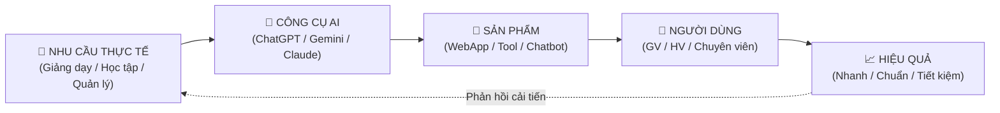
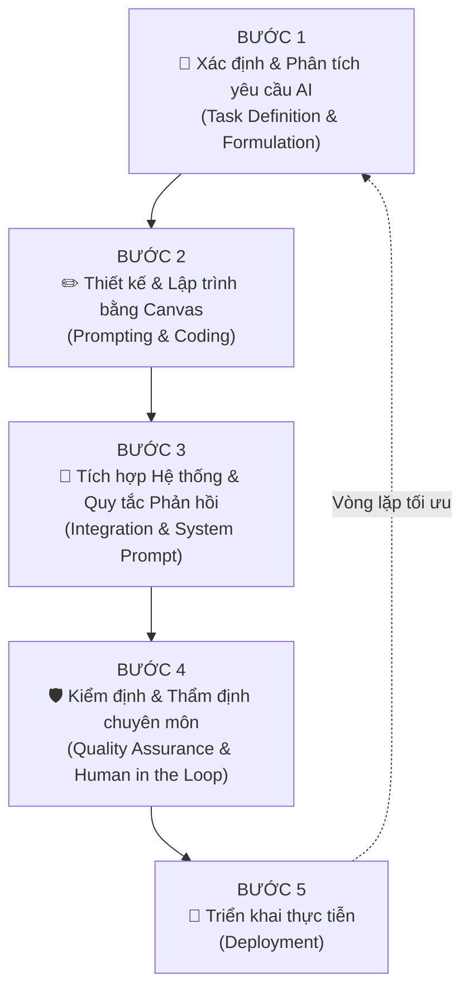
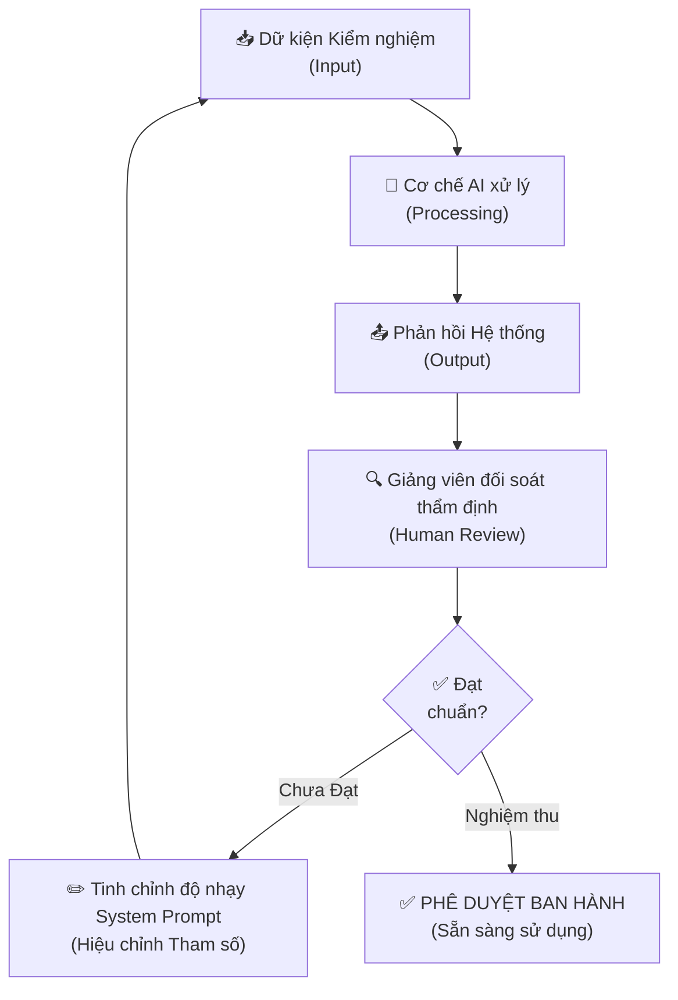
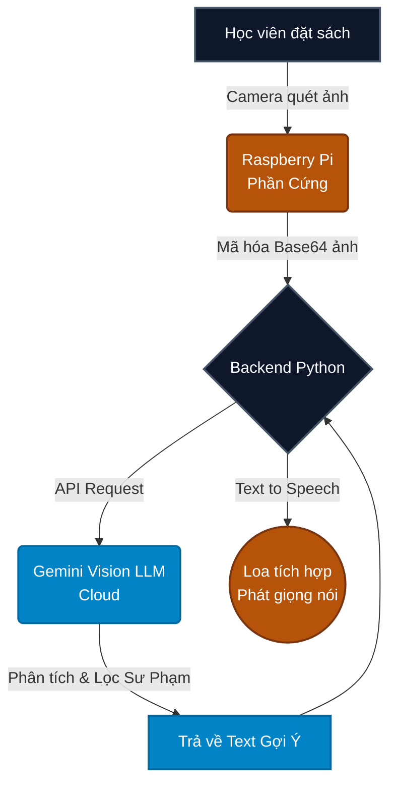

# XÂY DỰNG ỨNG DỤNG AI TRONG MÔI TRƯỜNG HÀNH CHÍNH - QUÂN SỰ - SƯ PHẠM

## MỤC ĐÍCH – ĐỐI TƯỢNG – PHẠM VI ÁP DỤNG

### Mục đích

Tài liệu này được biên soạn dưới góc độ **chuyên sâu** của một chuyên gia thiết kế giáo dục, nhằm cung cấp:

- Một **quy trình chuẩn hóa**, mang tính kỷ luật, logic và chính xác cao để xây dựng các ứng dụng AI phục vụ nhiệm vụ huấn luyện, giảng dạy và quản lý trong nhà trường cơ sở giáo dục.
- Một **khung tư duy hành động** giúp chuyên viên, giảng viên chuyển đổi từ người dùng thụ động sang **Người Quản Lý AI** – chủ động khai thác trí tuệ nhân tạo như một công cụ thực tiễn thông tin.

### Đối tượng sử dụng

| STT | Đối tượng | Vai trò |
|-----|-----------|---------|
| 1 | Lãnh đạo, Quản lý các cấp | Nắm bắt tổng quan, phê duyệt triển khai |
| 2 | Giảng viên các khoa chuyên ngành | Trực tiếp xây dựng và sử dụng công cụ AI |
| 3 | Chuyên viên quản lý giáo dục | Ứng dụng AI vào công tác hành chính, hành chính |

### Yêu cầu tiên quyết

- **Không** yêu cầu nền tảng lập trình.
- **Không** yêu cầu kiến thức chuyên sâu về thuật toán AI.
- **Chỉ cần**: Khả năng sử dụng máy tính cơ bản và tư duy ra yêu cầu rõ ràng.

> **Key Takeaway:** Tài liệu này biến mọi chuyên viên, giảng viên thành Người Quản Lý AI – không cần biết lập trình, chỉ cần biết ra lệnh đúng.

---

## PHẦN I: NẮM VỮNG TƯ DUY CỐT LÕI

### 1.1. Định vị AI trong môi trường học thuật – giáo dục

Trong môi trường học thuật và giáo dục, AI **không phải** là một môn học để nghiên cứu lý thuyết vi mô. AI là một **công cụ thực tiễn** để **TẠO RA SẢN PHẨM PHỤC VỤ NHIỆM VỤ**.

| Tư duy sai ❌ | Tư duy đúng ✅ |
|---------------|----------------|
| AI là môn học lý thuyết | AI là **công cụ tạo sản phẩm** |
| Cần học thuật toán, mô hình | Cần học cách **ra yêu cầu chính xác** |
| Chỉ chuyên gia IT mới dùng được | **Mọi chuyên viên, giảng viên** đều dùng được |
| AI thay thế con người | AI là **công cụ hỗ trợ** dưới quyền quản lý |

### 1.2. Vai trò "Người Quản Lý AI"

Chúng ta **không** yêu cầu chuyên viên, giảng viên học cách AI tính toán thuật toán. Chúng ta yêu cầu họ đóng vai trò **Người Quản Lý Hệ Thống**, cụ thể:

1. **Đưa ra nhiệm vụ rõ ràng** – Xác định chính xác bài toán cần giải quyết.
2. **Ra yêu cầu (Prompt) chính xác** – Viết chỉ thị cho AI theo cấu trúc chuẩn.
3. **Kiểm duyệt chặt chẽ kết quả** – Không "khoán trắng", luôn thẩm định đầu ra.
4. **Đóng gói thành công cụ** – Biến kết quả thành sản phẩm phục vụ thực tế.

### 1.3. Ba lĩnh vực ứng dụng trọng tâm

| Lĩnh vực | Ứng dụng cụ thể | Ví dụ |
|-----------|-----------------|-------|
| **Huấn luyện, giảng dạy** | Soạn giáo án, tạo đề thi, thiết kế bài giảng | Công cụ sinh giáo án tự động |
| **Học tập, nghiên cứu** | Hỏi đáp, tóm tắt tài liệu, ôn tập | Trợ giảng ảo Aura AI |
| **Quản lý, quản lý hành chính** | Soạn báo cáo, tổng hợp kế hoạch | Trợ lý Hành chính AI |

---

### SƠ ĐỒ 1: TỔNG THỂ HỆ THỐNG AI TRONG NHÀ TRƯỜNG CƠ SỞ GIÁO DỤC



> **Mô tả sơ đồ:** Hệ thống AI trong nhà trường cơ sở giáo dục vận hành theo vòng khép kín: Từ nhu cầu thực tế → AI xử lý → Tạo sản phẩm → Người dùng sử dụng → Đánh giá hiệu quả → Phản hồi để cải tiến. Vòng lặp này đảm bảo sản phẩm AI luôn sát nhiệm vụ thực tế.

**Hình minh họa đề xuất:**
- Sơ đồ vòng tròn 5 thành phần với mũi tên liên kết, trung tâm là biểu tượng nhà trường cơ sở giáo dục.
- Mỗi thành phần có icon đại diện và màu sắc phân biệt (xanh chủ đạo là chủ đạo).
- Phù hợp để đặt ở slide mở đầu hoặc trang bìa phụ của tài liệu.

---

## PHẦN II: QUY TRÌNH 5 BƯỚC XÂY DỰNG ỨNG DỤNG AI SƯ PHẠM HỌC THUẬT

### SƠ ĐỒ 2: QUY TRÌNH 5 BƯỚC – TỔNG QUAN



> **Mô tả sơ đồ:** Quy trình tinh gọn 5 bước được thiết kế theo dạng vòng lặp tuyến tính (Linear Feedback Loop). Sau khi sản phẩm được triển khai (Bước 5), những đóng góp từ thực tế sẽ ngay lập tức được dội ngược về Bước 1, tạo nên một cỗ máy sản xuất phần mềm liên tục hoàn thiện theo đúng triết lý của môi trường học thuật.

**Hình minh họa đề xuất:**
- Sơ đồ dạng bậc thang 5 bước đi lên, mỗi bước có icon và màu gradient từ đậm đến nhạt.
- Mũi tên phản hồi từ bước 5 quay về bước 1 thể hiển vòng cải tiến liên tục.
- Phù hợp cho slide tổng quan quy trình.

---

### BƯỚC 1: XÁC ĐỊNH VÀ PHÂN TÍCH YÊU CẦU AI (TASK DEFINITION AND FORMULATION)

#### 1. Nguyên tắc khởi nguồn

> Mọi ứng dụng AI trong môi trường học thuật phải xuất phát trực tiếp từ một **yêu cầu tối ưu hóa năng suất thực tiễn**. Việc xây dựng phần mềm cần dựa trên cơ sở đáp ứng đúng mục tiêu giải quyết các vướng mắc trong quản lý giáo dục. Sử dụng AI phải mang lại "giá trị cốt lõi" thực tế thay vì chỉ mô phỏng tính năng.

#### 2. Cơ chế Phân tích Nhiệm vụ (Input - Output)

Khi đã xác định được yêu cầu cụ thể (Ví dụ: Tối ưu thời gian cho giảng viên trong việc biên soạn một bộ câu hỏi ôn tập 20 câu đo lường năng lực), chuyên viên/giảng viên cần tiến hành chuyển hóa nhiệm vụ đó sang dạng cấu trúc dữ liệu để hệ thống trí tuệ nhân tạo có thể tiếp nhận và xử lý. Quy trình đó gọi là quy hoạch sơ đồ Đầu vào - Đầu ra (Input - Output).

| Thành phần | Định nghĩa học thuật | Ví dụ thực tế |
|------------|-------------|-------|
| **Input (Đầu vào)** | Nguồn dữ liệu thô cung cấp cho hệ thống AI | Văn bản tài liệu tham khảo 50 trang, mô hình điểm số thô, danh sách các câu hỏi của người học |
| **Output (Đầu ra)** | Thành phẩm có cấu trúc yêu cầu AI trích xuất và hình thành | Tài liệu giáo án chuẩn biểu mẫu, thống kê phân tích số liệu dạng bảng, thông điệp phản hồi chuẩn mực |

#### 3. Quy tắc Định lượng Tham số Đầu vào
- **Không sử dụng chỉ thị mang tính chủ quan**: Tránh sử dụng các tham số định tính và mơ hồ như "Hãy viết một tài liệu bài học hay". Đây là yêu cầu thiếu khả năng đánh giá kết quả số hóa.
- **Thiết lập chỉ tiêu định lượng rõ ràng**: Phải yêu cầu chi tiết như "Bóc tách và trích xuất **20 câu** hỏi trắc nghiệm, mỗi câu đảm bảo tương ứng **4 phương án lựa chọn** (A, B, C, D)".
- **Đảm bảo tính chuẩn hóa văn bản**: Chỉ định rõ "Kết xuất định dạng văn bản dưới dạng bảng dữ liệu biểu mẫu, thống nhất phông chữ theo quy chuẩn tài liệu".

> **Key Takeaway:** Quá trình giao tiếp lệnh vào AI cần được đánh giá một cách minh bạch tương tự quá trình bàn giao nhiệm vụ dự án có hệ thống: Mọi cơ sở phải được quy định trực quan về **Thông điệp chi tiết (Nội dung cần thực thi)**, **Phạm vi khối lượng (Định mức độ ranh giới)** và **Cơ chế xuất (Theo chuẩn hóa của định dạng nào)**.

**Hình minh họa đề xuất:**
- Sơ đồ hai cột Input → Output, giữa là biểu tượng AI đánh dấu quá trình xử lý, với bảng biểu chi tiết phân tích từng phần tử.

---

### BƯỚC 2: THIẾT KẾ VÀ LẬP TRÌNH BẰNG YÊU CẦU (PROMPTING & CANVAS CODING)

#### 1. Nguyên lý Thiết kế Thực Dụng

Giao diện (UI) của một công cụ AI sư phạm tuyệt đối không được rườm rà. Thiết kế chuẩn mực nhất là **Giao diện 1 Chạm (One-Click UI)**:
- **1 khu vực nhập liệu**: Để người dùng paste văn bản, câu hỏi.
- **1 nút bấm duy nhất**: Rõ ràng, dễ thấy (Vd: "Phân tích ngay", "Tạo giáo án").
- **1 khu vực hiển thị kết quả**: Trình bày đẹp, có thể dễ dàng Copy lấy dữ liệu.

#### 2. Kỹ thuật Lập trình Không Cần Cú Pháp (No-Code Development via Prompts)

Đây là khoảnh khắc đột phá nhất. Thay vì phải đi học viết từng hàm Javascript, chuyên viên chỉ cần gõ "Yêu cầu" (Prompt) chỉ đạo AI viết mã nguồn thay cho mình.

**Quy trình Lặp (Iterative Refinement):**

1. **Khởi lệnh ban đầu**: "Hãy đóng vai một Kỹ sư phần mềm. Dựa trên bản nháp Input-Output của Chương 1, hãy viết cho tôi toàn bộ mã HTML/CSS/JS..."
2. **Kích hoạt Workspace / Canvas Preview**: Sử dụng các tính năng mới nhất của AI (Ví dụ: Nút "Canvas" của ChatGPT hay thanh Preview trên Claude) để yêu cầu rọi thẳng mã nguồn thành bản nháp Giao diện thật trên màn hình mà chưa cần lưu file ra ngoài.
3. **Tinh chỉnh tự nhiên**: Ngồi xem bản nháp, và ra lệnh điều chỉnh như sếp với nhân viên. VD: *"Màu xanh hiện tại hơi chói mắt, hãy đổi qua màu áo lính và bo tròn nút gửi."* Giao diện bên kia màn hình sẽ tự động cập nhật ngay lập tức.
4. **Nghiệm thu bản hoàn thiện**: Khi đã đạt trạng thái hoàn hảo 100%, tiến hành lưu khối mã nguồn đó dưới đuôi `.html` (ví dụ `cong_cu_soan_thao.html`).

> **Key Takeaway:** Hãy coi quá trình lập trình này là một cuộc trò chuyện thương thảo. Bạn không viết Code, bạn đang đàm phán với AI về cách xây dựng một căn nhà số.

---

### BƯỚC 3: TÍCH HỢP HỆ THỐNG VÀ THIẾT LẬP QUY TẮC PHẢN HỒI (INTEGRATION & SYSTEM PROMPT)

#### 1. Nguyên tắc Tích hợp Lõi Xử lý Thông minh

Sản phẩm ở Bước 2 mới chỉ dừng ở mức một giao diện ứng dụng front-end tương tác căn bản. Để hệ thống có khả năng tự động xử lý thông tin thông minh và trả lời người học, ứng dụng cần được tích hợp Mô hình ngôn ngữ lớn (LLM) thông qua cơ chế API.

#### 2. Giao thức Kết nối API (Application Programming Interface)

**API** thiết lập một kênh kết nối logic chuẩn hóa định danh giữa nền tảng ứng dụng nội bộ và máy chủ trung tâm AI:
- Thông điệp truy vấn ngôn ngữ của người dùng được mã hóa và truyền qua cổng kết nối API.
- Cụm máy chủ AI tiếp nhận yêu cầu, phân tích ngôn ngữ tự nhiên theo các tham số nhận dạng và khởi tạo dữ liệu phản hồi nội dung văn bản.
- Giao thức API trao trả cấu trúc phản hồi về lại ứng dụng một cách tự động, quá trình đồng bộ hóa này thường duy trì độ trễ ở mức đảm bảo chất lượng nghiệp vụ (dưới 2 giây).

#### 3. System Prompt (Cấu hình Cơ chế Hệ thống)

Một mô hình AI nguyên bản với dữ liệu đào tạo mở trên toàn cầu thường trả lời các chủ đề không được chọn lọc một cách tổng quan đa khu vực. Đối với môi trường hoạt động hành chính, nếu công cụ AI được phép vượt quyền tư vấn không có giới hạn, sẽ đánh mất khả năng bảo đảm kỷ luật nội dung. Vì thế, cần đưa các quy tắc hệ thống thông qua việc lập trình một bộ luật gọi là **System Prompt (Lệnh Cấu hình Hệ thống nền tảng)**.

**Mẫu cấu trúc hệ thống điển hình:**
```
"Vai trò: Chuyên viên tư vấn hành chính của nhà trường. 
Quy tắc 1: Cần lưu ý danh xưng tương tác lịch sự là 'đồng chí', tự xưng là 'tôi'.
Quy tắc 2: Giọng điệu khách quan, ngôn từ chính thống học thuật quân phiệt. Tuyệt đối bám sát đường lối chuẩn mực của cơ quan, không thể hiện thái độ chủ quan.
Quy tắc 3: Nếu câu hỏi nằm ngoài phạm vi học thuật theo nhiệm vụ, cần phản hồi từ chối khéo léo thông báo sự vụ thuộc vùng thẩm quyền của giáo viên thực nghiệm."
```

> **Key Takeaway:** Lệnh cấu hình hệ thống (System Prompt) có vai trò thiết lập khung hành vi chuẩn mực. Cấu trúc mô hình AI phải được bảo vệ bởi ranh giới những nguyên tắc xử lý thì mới thỏa mãn được điều kiện cung cấp và triển khai tại các ban ngành tổ chức trường học.

---

### BƯỚC 4: KIỂM ĐỊNH CHẤT LƯỢNG VÀ THẨM ĐỊNH CHUYÊN MÔN (QUALITY ASSURANCE & HUMAN IN THE LOOP)

#### 1. Yêu cầu Kiểm duyệt độc lập - Đảm bảo Tính Chính xác Dữ liệu

Môi trường công nghệ giáo dục không chấp nhận xảy ra hiện tượng sản sinh thông tin có tính xác thực kém hay dữ liệu bị hiểu sai lệch (Hallucinations). Việc nghiệm thu tính sẵn sàng của ứng dụng AI phải bắt buộc thông qua hệ thống kiểm thử chéo gồm góc độ kỹ thuật và góc độ con người thực hiện chuyên ngành.

#### 2. Kịch bản Kiểm định (Test Cases)

**Kiểm định Cấp độ Kỹ thuật (Technical Test):**
- Thử nghiệm cung cấp các định dạng dữ liệu đầu vào không hợp lệ để kiểm tra hệ thống có khả năng đưa ra cảnh báo bắt lỗi ngoại lệ, thay vì dẫn tới sự cố sập ứng dụng hay không.
- Giả lập việc không điền đủ form thông tin bắt buộc, tiến hành truy vấn nhằm xác minh chức năng yêu cầu báo "Yêu cầu bổ sung dữ liệu" được hoạt động như kỳ vọng.

**Thẩm định Cấp độ Nội dung (Red Teaming Test):**
- Lập kịch bản sử dụng giả đóng vai người gây rối cung cấp thông điệp nội dung nhạy cảm ngoài ranh giới chính sách, để có thể kiểm chứng xem cơ chế System Prompt có đủ để nhận dạng việc từ chối phản hồi hay không.
- Sử dụng mô hình kiểm duyệt bởi con người chuyên gia độc lập đối chứng. Thực nghiệm trích một hồ sơ công việc xử lý tự động, mang cho một giảng viên trực tiếp tham khảo và đối soát nhằm đánh giá tỷ lệ chuyển dịch kết quả và tỷ lệ thất thoát yếu tố bản sắc của tổ chức.

### SƠ ĐỒ 3: VÒNG LẶP KIỂM ĐỊNH TỐI ƯU (QA LOOP)



> **Key Takeaway:** Thuật toán xác suất luôn tồn tại khoảng dung sai. Vì vậy, trách nhiệm thẩm quyền phê duyệt đầu ra luôn phải đặt dưới quản trị của con người. Cần duy trì nguyên sinh quan sát toàn bộ phân tích AI cho tới khi chúng thực sự vượt qua quá trình kiểm soát thực nghiệm khách quan.

---

### BƯỚC 5: TRIỂN KHAI THỰC TIỄN & ĐÓNG GÓI (DEPLOYMENT)

#### 1. Triển khai vào hạ tầng (Vận hành)

Khi hoàn tất mọi bài toán, bộ công cụ AI phải rời khỏi máy phòng lab để bước ra ánh sáng, phục vụ hàng chục hàng trăm người trong nhà trường.
Tùy thuộc vào chính sách bảo mật từng vùng dự án mà ta có:
*   **Deploy Nội bộ (Mạng LAN)**: An toàn tuyệt đối nhất. Sản phẩm sẽ nằm trên máy chủ nội bộ.
*   **Deploy Công khai (Public Web)**: Khai thác tiện ích đám mây giúp người học truy cập hệ sinh thái mọi nơi mọi lúc thông qua Internet.

#### 2. Tập huấn và Khai thác

*   Tổ chức các buổi Hội thảo chuyển giao ngắn (dưới 30 phút) để phổ cập giao diện ứng dụng.
*   Thiết lập kênh thu nhận lỗi (Bug Report). Trong thời gian 1 tháng đầu, mỗi phản hồi từ đồng đội chính là nguyên liệu quý giá để dội ngược sự khắc phục về Bước 1, tiếp tục hoàn thiện chu kỳ phát sinh `v2.0, v3.0`.

> **Key Takeaway:** Xây dựng phần mềm xong chưa phải là đích đến, việc làm cho nó bám rễ vào từng mạch máu hoạt động hàng ngày mới chính là đỉnh cao của sự đổi mới và số hóa giáo dục.

---

## PHẦN III: CÁC MÔ HÌNH SẢN PHẨM THỰC TẾ TRONG NHÀ TRƯỜNG

> Dưới đây là 2 ví dụ cụ thể, áp dụng triệt để quy trình 5 bước. Mỗi ví dụ được trình bày theo cấu trúc: Mục tiêu → Thiết kế → Lập trình → System Prompt → Áp dụng.

---

### VÍ DỤ 1: CHATBOT AI HỖ TRỢ HỌC TẬP (EDUBOT)

<div style="display: flex; gap: 32px; align-items: flex-start; margin: 30px 0; flex-wrap: wrap;">
  <div style="flex: 6; min-width: 300px;">

#### Bước 1: Xác định & Phân tích Bài toán
- **Khó khăn thực tiễn:** Học viên tự học buổi tối không có người giải đáp tức thời các thắc mắc về lập trình và thiết kế.
- **Input:** Câu hỏi văn bản (Text) hoặc lỗi code từ học viên.
- **Output:** Giao diện WebApp Chatbot chạy mượt mà trên điện thoại và máy tính, hoạt động 24/7.

#### Bước 2: Thiết kế & Lập trình bằng Canvas
> Chuyên viên không cần viết một dòng code nào. Thay vào đó, gõ đoạn lệnh sau vào Gemini:

```text
"Hãy đóng vai Lập trình viên Frontend. 
Tôi cần mã nguồn cho một WebApp giao diện Chatbot tên là 'EduBot'.
YÊU CẦU:
1. Viết bằng HTML, CSS và JS trong 1 file.
2. Vùng chat ở giữa: Có giao diện tin nhắn người dùng (phải) và AI (trái).
3. Khung nhập câu hỏi ở dưới cùng kèm nút 'Gửi'."
```
*Tận dụng tính năng Canvas:* Sau khi Gemini lên khung tĩnh, tiếp tục gửi lệnh: *"Đổi màu nền khung chat sang xám nhạt, viền bo tròn, và làm nút gửi nổi bật thành màu đỏ"*. Canvas sẽ tự động biến đổi giao diện cực đẹp mắt ngay trên màn hình.

#### Bước 3: Tích hợp Lõi AI & System Prompt
Gắn API của Gemini vào WebApp và thiết lập kỷ luật ngôn từ (System Prompt):
```text
"Đồng chí là Trợ giảng Ảo EduBot. Gọi người dùng là 'đồng chí học viên'. Chỉ gợi ý cách giải quyết vấn đề, tuyệt đối KHÔNG đưa đáp án làm sẵn."
```

#### Bước 4: Kiểm thử Kép & Nghiệm thu
- **Kiểm thử logic:** Nhập thử câu hỏi sai cú pháp xem nút "Gửi" có kẹt không.
- **Kiểm duyệt nội dung (QA):** Thử ép Bot giải nguyên bài toán để xem System Prompt đã chặn tốt chưa.

#### Bước 5: Triển khai & Đóng gói
Đóng gói mã nguồn 1 file HTML, đưa lên Vercel hoặc Host nội bộ mạng LAN để hàng trăm học viên cùng truy cập qua link rút gọn.

  </div>
  
  <div style="flex: 4; min-width: 300px; position: sticky; top: 20px;">
    <div style="background: #0f172a; padding: 16px; border-radius: 16px; box-shadow: 0 10px 25px rgba(0,0,0,0.15);">
      <div style="display: flex; alignItems: center; gap: 10px; margin-bottom: 12px;">
        <span style="font-size: 20px;">🎬</span>
        <h4 style="color: #f8fafc; margin: 0; font-size: 1.1rem;">Video Ứng Dụng (Canvas)</h4>
      </div>
      <video controls style="width: 100%; border-radius: 8px; border: 1px solid #334155;" poster="./cover.png">
        <source src="./videos/tutorial_1_v4.mp4" type="video/mp4" />
      </video>
    </div>
  </div>
</div>

---

### VÍ DỤ 2: ĐÈN HỌC THÔNG MINH AI (SMART IOT LAMP)

<div style="display: flex; gap: 32px; align-items: flex-start; margin: 30px 0; flex-wrap: wrap;">
  <div style="flex: 6; min-width: 300px;">

#### Bước 1: Xác định & Phân tích Bài toán 
- **Khó khăn thực tiễn:** Học sinh làm bài tập toán ở nhà sai tư thế và thiếu người chỉ dẫn tư duy logic.
- **Giải pháp phần cứng:** 1 chiếc Đèn bàn tích hợp Camera USB + vi mạch Raspberry Pi.
- **Input:** Khung hình (Image) quyét từ Camera chứa nội dung trang bài tập tiếng Anh/toán.
- **Output:** Đèn nháy sáng báo hiệu đã nhận chữ, Loa tí hon phát ra giọng nói gợi ý điểm cốt lõi của bài toán.

#### Bước 2: Thiết kế & Lập trình (Phần Cứng + Web Dashboard)
Sử dụng Gemini để viết code điều khiển phần cứng thay vì tự mày mò:
```text
"Hãy viết cho tôi một đoạn mã Python chạy trên Raspberry Pi.
Nhiệm vụ: Khi cảm biến khoảng cách nhận diện có người ngồi dưới đèn học, Camera sẽ chụp tĩnh 1 bức ảnh.
Gửi bức ảnh đó qua hàm API."
```
Đồng thời, yêu cầu AI viết 1 giao diện Web nội bộ siêu tối giản cho Điêù Hành (Phụ huynh/Giáo viên) để xem nhật ký học tập.

#### Bước 3: Tích hợp Lõi AI Vision & System Prompt
Sử dụng mô hình thị giác máy tính (**Gemini Pro Vision**). Khi Camera gửi ảnh đề toán học từ mặt bàn lên:
- **System Prompt (Sư phạm tích cực):** *"Phân tích bức ảnh chứa đề bài tập. Tìm ra công thức hình học liên quan nhưng TUYỆT ĐỐI không tính ra kết quả. Trả về cho hệ thống một câu văn động viên ngắn gọn mạch lạc để phát ra Loa."*

#### Bước 4: Kiểm thử Kép & Nghiệm thu
- **Kiểm thử Vật lý:** Cắm lại nguồn cấp điện nhiều lần xem Raspberry Pi có cháy không. Test chụp ảnh trong điều kiện ánh sáng chói.
- **Kiểm thử AI:** Đưa một bài toán sai đề hoàn toàn đè dưới camera xem AI xử lý sự cố thế quái nào (Hallucination QA).

#### Bước 5: Triển khai Thực Tiễn
In 3D vỏ bọc chiếc đèn. Bố trí đưa vào thử nghiệm tại góc học tập của 5 gia đình tình nguyện. Xây dựng tài liệu tập huấn bằng video gửi qua Zalo phụ huynh. Hệ sinh thái phần cứng chính thức sống hòa hợp cùng phần mềm!

#### Lưu đồ Hệ thống (Phần Cứng & Trí Tuệ Nhân Tạo)


  </div>
  
  <div style="flex: 4; min-width: 300px; position: sticky; top: 20px;">
    <div style="background: #0f172a; padding: 16px; border-radius: 16px; box-shadow: 0 10px 25px rgba(0,0,0,0.15); margin-bottom: 20px;">
      <div style="display: flex; alignItems: center; gap: 10px; margin-bottom: 12px;">
        <span style="font-size: 20px;">🎬</span>
        <h4 style="color: #f8fafc; margin: 0; font-size: 1.1rem;">Video Lập trình IoT</h4>
      </div>
      <video controls style="width: 100%; border-radius: 8px; border: 1px solid #334155;" poster="./cover.png">
        <source src="./videos/tutorial_2_v4.mp4" type="video/mp4" />
      </video>
    </div>
    <div style="background: #0f172a; padding: 16px; border-radius: 16px; box-shadow: 0 10px 25px rgba(0,0,0,0.15);">
      <div style="display: flex; alignItems: center; gap: 10px; margin-bottom: 12px;">
        <span style="font-size: 20px;">💡</span>
        <h4 style="color: #f8fafc; margin: 0; font-size: 1.1rem;">Điểm cốt lõi Phần cứng</h4>
      </div>
      <p style="color: #cbd5e1; font-size: 0.95rem; line-height: 1.6;">
        Việc kết hợp Phần cứng (Đèn, Loa, Camera) với trí tuệ nhân tạo mây (Gemini Vision) chứng minh năng lực thiết kế "Không giới hạn" của quy trình 5 Bước. Ở đây, AI đảm nhiệm vai trò <b>Kỹ sư Lập trình Nhúng</b> giúp viết mã Python cho Raspberry Pi.
      </p>
    </div>
  </div>
</div>


---

## PHẦN IV: NẮM VỮNG CÁC LỖI SAI CẦN TRÁNH TRONG THIẾT KẾ CÔNG CỤ AI

### Lỗi 1: BỎ QUÊN "CON NGƯỜI" TRONG LƯU ĐỒ THUẬT TOÁN (NO HUMAN-IN-THE-LOOP)

> **Tuyệt đối không** xây dựng công cụ AI mà không có nút/bước ký duyệt của chuyên gia trước khi dữ liệu được chuyển đi hoặc lưu trữ.

| Sai lầm chết người | Lệnh Prompt lập trình chuẩn |
|-----|------|
| Code tự động đẩy dữ liệu sinh từ AI thẳng lên Hệ thống Đào tạo. | Yêu cầu AI code: "Sau khi AI trả kết quả, phải hiện lên một Textbox để người dùng xem lại và sửa. Chỉ khi bấm nút 'Ký Duyệt' thì quy trình mới kết thúc." |

### Lỗi 2: CHỈ YÊU CẦU LOGIC MÀ QUÊN MẤT UI (GIAO DIỆN)

> Viết ra một WebApp thì phải có form nhập liệu rõ ràng. Đừng ép người dùng cuối phải nhìn màn hình đen sì của lập trình viên.

| Lệnh thiết kế sai ❌ | Lệnh thiết kế đúng ✅ |
|---------------|----------------|
| "Viết code kết nối Gemini API để làm tóm tắt văn bản." | "Thiết kế WebApp bằng HTML/Tailwind. Phía trên là khung Header đỏ đô chuyên nghiệp. Ở giữa chia làm 2 cột: Cột trái chứa Form nhập liệu có viền bóng đổ, cột phải chứa phần hiển thị kết quả. Chức năng ở phía sau dùng JS để kết nối API..." |

### Lỗi 3: KHÔNG THIẾT KẾ XỬ LÝ LỖI (ERROR HANDLING) ĐƯỜNG TRUYỀN

**Vấn đề:** Khi AI server bị quá tải (delay), kết quả có thể mất 15-20 giây mới trả về. Nếu không báo cho người dùng, họ sẽ bấm nút gửi lại liên tục làm treo máy.

| Hậu quả | Lệnh khắc phục ngay trong Prompt |
|---------|---------------------------------|
| Người sử dụng bấm liên tục vì tưởng nút bấm bị hỏng | "Thêm tính năng bắt lỗi mạng. Nhấn nút tạo báo cáo phải hiển thị trạng thái 'Loading/Vòng xoay' và vô hiệu hóa nút bấm tạm thời. Nêú kết nối thất bại sau 10s, hiển thị cảnh báo đỏ 'Vui lòng thử lại'". |

> **Key Takeaway:** Bạn đang ra lệnh để máy tính tự xây dựng một công cụ hoàn chỉnh. Suy nghĩ chặt chẽ như một Kiến trúc sư Hệ thống: Có Đầu vào (UI), Có Xử lý (Logic+AI), Có Bảo mật, và Có Bắt lỗi mạng.

---

## PHẦN V: BÀI TẬP TRẮC NGHIỆM ĐÁNH GIÁ (QUIZ)

> Dưới đây là bài kiểm tra gồm **10 câu hỏi trắc nghiệm** (kết hợp lý thuyết và tư duy thực tiễn) giúp đồng chí hệ thống lại toàn bộ kiến thức trong tài liệu học thuật này. 
> 
> **Lưu ý:** Đồng chí cần đạt ít nhất **8/10 điểm** để vượt qua bài kiểm tra. Sau khi hoàn thành, hệ thống sẽ tự động chấm điểm và tổng kết các kiến thức cốt lõi.
> 
> *Hãy bắt đầu làm bài kiểm tra ngay trên màn hình dưới đây!*

---

## PHẦN VI: BÀI TẬP THỰC TIỄN DÀNH CHO CÁN BỘ, GIẢNG VIÊN

> **Lưu ý:** Với các nhiệm vụ thực hành dưới đây, người học phải tự vận động tư duy lập trình bằng yêu cầu. Các thao tác đều tuân thủ nguyên tắc: Ghi lệnh → Copy Code → Lưu thành file .html → Mở trên trình duyệt.

---

### Nhiệm vụ 1: Dành cho Giảng viên – Tạo công cụ Tính Điểm Trung Bình

**Mục tiêu:** Trải nghiệm trực tiếp quy trình "Lập trình bằng yêu cầu". Lấy cảm hứng từ thực tiễn để sinh ra Code.

**Bước 1: Mở ứng dụng AI và nhập Prompt sau:**
```text
"Đóng vai lập trình viên. Hãy viết mã HTML/CSS/JS trong 1 file duy nhất để tạo công cụ 'Tính điểm trung bình môn'.
Giao diện màu xanh rêu chuẩn giáo dục.
Gồm 3 ô nhập điểm (chuyên cần, giữa kỳ, trung bình thi). Nút bấm 'Tính toán'.
Hiển thị kết quả Điểm tổng và Text đánh giá (Giỏi/Khá/Trung bình/Yếu) bằng JS logic."
```

**Bước 2:** Copy toàn bộ kết quả, đưa vào phần mềm Notepad.
**Bước 3:** Bấm Save As, chọn đuôi file là `tinh_diem.html`. Mở bằng trình duyệt để kiểm tra thành quả của đồng chí.

---

### Nhiệm vụ 2: Dành cho Chuyên viên lý – Tạo WebApp Lịch Công Tác

**Mục tiêu:** Thoát khỏi sự bó buộc của bảng tính Excel thủ công, tự tay tạo một phần mềm Quản lý Lịch của riêng mình.

**Bước 1: Gửi Prompt yêu cầu thiết kế tính năng:**
```text
"Hãy viết 1 file HTML kết hợp AlpineJS hoặc Pure JS tạo ứng dụng 'Quản lý Lịch Tuần'.
Giao diện: Một bảng lưới lịch 7 ngày đẹp mắt (màu nhấn đỏ thẫm).
Tính năng: Form nhập liệu thêm công việc nằm bên trái. Khi nhấn 'Lưu', dữ liệu xuất hiện vào ngày tương ứng trong lưới lịch. Code thật gọn gàng, chia sẵn layout Flexbox."
```

**Bước 2:** Sau khi copy và lưu tệp code thành `lich_tuan.html`, hãy tự tải lên bất kỳ trình duyệt nào.
Ghi chú: Nếu hệ thống chưa đẹp như kỳ vọng, hãy yêu cầu AI *đổi màu nền thành sáng hơn* và cấp nhật thay thế mã nguồn hiện tại.

---

### Nhiệm vụ 3: Tự Code Công Cụ "Tổng Tài Giải Mã" (Hỗ Chợ Học Viên)

**Mục tiêu:** Lập trình WebApp có 3 tab hiển thị nội dung tóm tắt để hỗ trợ sinh viên tiêu hóa văn bản phức tạp.

**Gợi ý Prompt để đồng chí tự triển khai:**
```text
"Lập trình SPA (Single Page Context) dùng HTML thuần và CSS:
- Nửa bên trái: Một khu vực Textarea khổng lồ có nút bấm to 'Phân Tích Kiến Thức'.
- Nửa bên phải: Có 3 thẻ Tabs (Tóm tắt / Thuật ngữ / Câu hỏi kiểm tra).
- Viết sẵn hàm Javascript giả lập 3 tab hoạt động khi nhấn vào (ẩn/hiện Content). Giao diện tối màu (Dark Mode) sành điệu."
```
Hãy lặp lại Bước 2 và 3 của Luyện tập 1. Thách thức lớn nhất ở đây là kiểm tra xem tính năng chuyển Tab bằng Javascript có hoạt động chưa.

---

### Nhiệm vụ 4: Công tác Kế Toán / Hành Chính – Viết "Trợ lý Hành văn Tự động"

**Mục tiêu:** Tạo form thu thập dữ kiện để in ra Báo cáo đầu tuần theo đúng thể thức chuyên nghiệp.

**Thực hành ra lệnh:** Hãy dùng kỹ năng cá nhân đã học từ Phần IV. Nếu đồng chí muốn phần mềm có các Input text như: "Quản lý sinh viên", "Kết quả trực trạm", "Vi phạm điểm danh", hãy tự viết Prompt ra lệnh cho AI vẽ 3 khu vực nhập liệu đó trên màn hình, và tích hợp 1 nút "Copy vào Clipboard". Cài đặt thành tài sản Web riêng của đồng chí.

---

## KẾT LUẬN

Tài liệu này đã trình bày **quy trình 7 bước** xây dựng ứng dụng AI trong môi trường học thuật – sư phạm, kèm theo **4 mô hình sản phẩm thực tế** đã được triển khai. Các nội dung trọng tâm cần nắm vững:

1. **AI là công cụ, không phải mục đích.** Mọi ứng dụng AI phải xuất phát từ nhu cầu thực tế.
2. **Chuyên viên, giảng viên là Người Quản Lý AI.** Không cần biết lập trình, chỉ cần biết ra lệnh đúng.
3. **Kiểm duyệt là bắt buộc.** Con người chịu trách nhiệm cuối cùng với mọi sản phẩm AI.
4. **Bảo mật là nguyên tắc thép.** Tuyệt đối không nhập dữ liệu mật vào AI public.
5. **Triển khai là bắt đầu, không phải kết thúc.** Cải tiến liên tục từ thực tế sử dụng.

> **Khẩu hiệu hành động:** *"Ra lệnh đúng – Kiểm duyệt chặt – Triển khai nhanh – Cải tiến liên tục."*

---

*Tài liệu biên soạn bởi Bộ môn Điện tử số – Khoa Cơ sở*
*Khánh Hòa, ngày 03 tháng 4 năm 2026*
